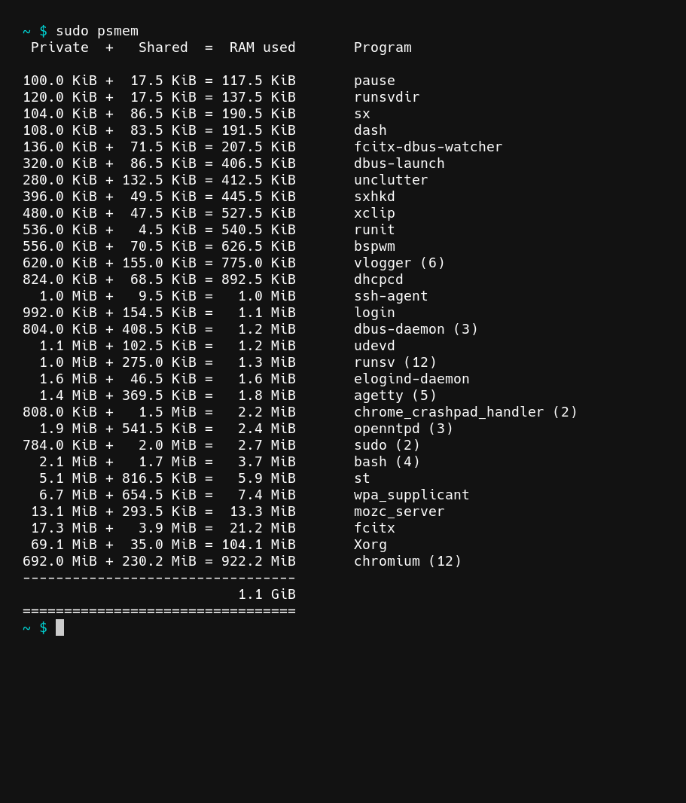

psmem
=====

## Description 

A clone of [ps\_mem](https://github.com/pixelb/ps_mem) written in C. 

## Features
* List all your current running processes and their ram usage.
* Runs without root permissions, although running with root permissions provides more accurate results.

## Dependencies

psmem requires POSIX make, an ANSI C compiler, the feature macro `DEFAULT_SOURCE`, `stdio.h`, `stdlib.h`, `string.h`, `unistd.h`, `libgen.h` and `dirent.h`.

## Installing

Build psmem with the provided makefile and move it to `$PATH`.

## Differences from ps\_mem

ps\_mem has some hacks to work with really old versions of the linux kernel(2.6.1 - 2.6.9), these hacks have not been reimplemented. ps\_mem also has the following arguments that have not been reimplemented `--split-args`, `--total`, `--discriminate-by-pid`, `--swap`, `-p`, `-w` these features are either better implemented as scripts that utilize psmem or as completely different tools. 

For example `--total` can be naively implemented as `psmem | tail -n 2 | head -n 1 | xargs`.

## Contributing

psmem is written in a plain C style, try to avoid introducing new dependencies and follow the same style. Features and ideas that can be implemented through a script or are better placed in a different tool will most likely be rejected. The Todo section is a good guideline for contributions.

## Todo

- [ ] Fuzzy test
- [ ] Write install target in makefile.
- [ ] Fallback to `smaps` if we cannot find `smaps_rollup`
- [ ] implement a -v option to list current version
- [ ] implement freebsd support, requires viewing uname and setting proc accordingly
- [ ] write a manpage
    - [ ] determine if -h is a good idea or if the manpage is good enough.

